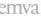

|   GEN<ì>CAM |   |  emva  |
| --- | --- | --- |
|  Version 2.7.1 | Standard Features Naming Convention  |   |

|  Interface | IEnumeration  |
| --- | --- |
|  Access | Read/Write  |
|  Unit | -  |
|  Visibility | Expert  |
|  Values | SingleLinkMultiLinkStaticLAGDynamicLAGPAUSEFrameReceptionPAUSEFrameGenerationIPConfigurationLLAIPConfigurationDHCPIPConfigurationPersistentIPStreamChannelSourceSocketStandardIDModeMessageChannelSourceSocketCommandsConcatenationWriteMemPacketResendEventEventDataPendingAckIEEE1588 (deprecated)PtpActionUnconditionalActionScheduledActionPrimaryApplicationSwitchoverExtendedStatusCodesExtendedStatusCodesVersion2_0DiscoveryAckDelayDiscoveryAckDelayWritableTestDataManifestTableCCPApplicationSocketLinkSpeedHeartbeatDisableSerialNumberUserDefinedNameStreamChannel0BigAndLittleEndianStreamChannel0IPReassemblyStreamChannel0MultiZoneStreamChannel0PacketResendDestination  |