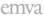

|  GEN<ì>CAM |   |   |
| --- | --- | --- |
|  Version 2.7.1 | Standard Features Naming Convention  |   |

Table 29-4 Tap geometrical properties –Ten taps

|  Geometry name |   | Tap | Tap geometrical properties  |   |   |   |   |   |
| --- | --- | --- | --- | --- | --- | --- | --- | --- |
|  Area-scan | Line-scan |   | X Start | X End | Step X | Y Start | Y End | Step Y  |
|  1X10-1Y | 1X10 | Tap1 | 1 | W-9 | 10 | 1 | H | 1  |
|   |   |  Tap2 | 2 | W-8 | 10 | 1 | H | 1  |
|   |   |  Tap3 | 3 | W-7 | 10 | 1 | H | 1  |
|   |   |  Tap4 | 4 | W-6 | 10 | 1 | H | 1  |
|   |   |  Tap5 | 5 | W-5 | 10 | 1 | H | 1  |
|   |   |  Tap6 | 6 | W-4 | 10 | 1 | H | 1  |
|   |   |  Tap7 | 7 | W-3 | 10 | 1 | H | 1  |
|   |   |  Tap8 | 8 | W-2 | 10 | 1 | H | 1  |
|   |   |  Tap9 | 9 | W-1 | 10 | 1 | H | 1  |
|   |   |  Tap10 | 10 | W | 10 | 1 | H | 1  |
|  10X-1Y | 10X | Tap1 | 1 | W/10 | 1 | 1 | H | 1  |
|   |   |  Tap2 | W/10+1 | 2W/10 | 1 | 1 | H | 1  |
|   |   |  Tap3 | 2W/10+1 | 3W/10 | 1 | 1 | H | 1  |
|   |   |  Tap4 | 3W/10+1 | 4W/10 | 1 | 1 | H | 1  |
|   |   |  Tap5 | 4W/10+1 | 5W/10 | 1 | 1 | H | 1  |
|   |   |  Tap6 | 5W/10+1 | 6W/10 | 1 | 1 | H | 1  |
|   |   |  Tap7 | 6W/10+1 | 7W/10 | 1 | 1 | H | 1  |
|   |   |  Tap8 | 7W/10+1 | 8W/10 | 1 | 1 | H | 1  |
|   |   |  Tap9 | 8W/10+1 | 9W/10 | 1 | 1 | H | 1  |
|   |   |  Tap10 | 9W/10+1 | W | 1 | 1 | H | 1  |