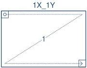
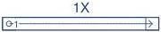

|  GENICAM |   | emva  |
| --- | --- | --- |
|  Version 2.7.1 | Standard Features Naming Convention  |   |

### 29.3 Tap Geometry Drawings

#### 29.3.1 Single Tap Geometry

1X-1Y (area-scan)

1 zone in X, 1 zone in Y.

Figure 29-1: Geometry 1X-1Y (area-scan)

1X (line-scan)

1 zone in X.

Figure 29-2: Geometry 1X (line-scan)