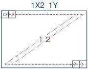
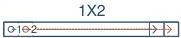
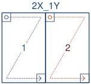
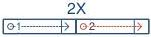

|  GEN<ì>CAM |   | emva  |
| --- | --- | --- |
|  Version 2.7.1 | Standard Features Naming Convention  |   |

#### 29.3.2 Dual Tap Geometries

1X2-1Y (area-scan)

1 zone in X with 2 taps, 1 zone in Y.

Figure 29-3: Geometry 1X2-1Y (area-scan)

1X2 (line-scan)

1 zone in X with 2 taps.

Figure 29-4: Geometry 1X2 (line-scan)

2X-1Y (area-scan)

2 zones in X, 1 zone in Y.

Figure 29-5: Geometry 2X-1Y (area-scan)

2X (line-scan)

2 zones in X.

Figure 29-6: Geometry 2X (line-scan)