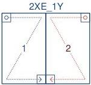
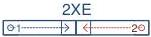
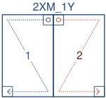

|  GEN<ì>CAM |   | emva  |
| --- | --- | --- |
|  Version 2.7.1 | Standard Features Naming Convention  |   |

2XE-1Y (area-scan)

2 zones in X with end extraction, 1 zone in Y.

Figure 29-7: Geometry 2XE-1Y (area-scan)

2XE (line-scan)

2 zones in X with end extraction.

Figure 29-8: Geometry 2XE (line-scan)

2XM-1Y (area-scan)

2 zones in X with middle extraction, 1 zone in Y.

Figure 29-9: Geometry 2XM-1Y (area-scan)

2XM (line-scan)

2 zones in X with middle extraction.

Figure 29-10: Geometry 2XM (line-scan)