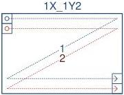
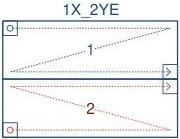

|   GEN<i>CAM |   |  emva  |
| --- | --- | --- |
|  Version 2.7.1 | Standard Features Naming Convention  |   |

1X-1Y2 (area-scan)

1 zone in X, 1 zone in Y with 2 taps.

Figure 29-11: Geometry 1X-1Y2 (area-scan)

1X-2YE (area-scan)

1 zone in X, 2 zones in Y with end extraction.

Figure 29-12: Geometry 1X-2YE (area-scan)