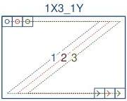
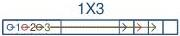
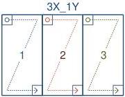
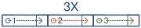

|  GEN<ì>CAM |   | emva  |
| --- | --- | --- |
|  Version 2.7.1 | Standard Features Naming Convention  |   |

### 29.4 Triple Tap Geometries

1X3-1Y (area-scan)

1 zone in X with 3 taps, 1 zone in Y.

Figure 29-13: Geometry 1X3-1Y (area-scan)

1X3 (line-scan)

1 zone in X with 3 taps.

Figure 29-14: Geometry 1X3 (line-scan)

3X-1Y (area-scan)

3 zones in X, 1 zone in Y.

Figure 29-15: Geometry 3X-1Y (area-scan)

3X (line-scan)

3 zones in X.

Figure 29-16: Geometry 3X (line-scan)