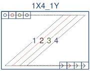
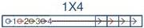
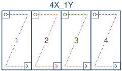
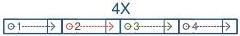

|  GEN<ì>CAM |   | emva  |
| --- | --- | --- |
|  Version 2.7.1 | Standard Features Naming Convention  |   |

### 29.5 Quad Tap Geometries

1X4-1Y (area-scan)

1 zone in X with 4 taps, 1 zone in Y.

Figure 29-17: Geometry 1X4-1Y (area-scan)

1X4 (line-scan)

1 zone in X with 4 taps.

Figure 29-18: Geometry 1X4 (line-scan)

4X-1Y (area-scan)

4 zones in X, 1 zone in Y.

Figure 29-19: Geometry 4X-1Y (area-scan)

4X (line-scan)

4 zones in X.

Figure 29-20: Geometry 4X (line-scan)