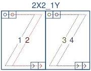
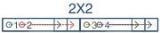
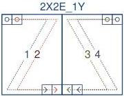
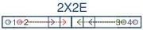

|  GEN<ì>CAM |   | emva  |
| --- | --- | --- |
|  Version 2.7.1 | Standard Features Naming Convention  |   |

2X2-1Y (area-scan)

2 zones in X with 2 taps, 1 zone in Y.

Figure 29-21: Geometry 2X2-1Y (area-scan)

2X2 (line-scan)

2 zones in X with 2 taps.

Figure 29-22: Geometry 2X2 (line-scan)

2X2E-1Y (area-scan)

2 zones in X with 2 taps and end extraction, 1 zone in Y.

Figure 29-23: Geometry 2X2E-1Y (area-scan)

2X2E (line-scan)

2 zones in X with 2 taps and end extraction.

Figure 29-24: Geometry 2X2E (line-scan)