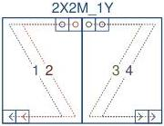
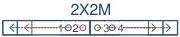
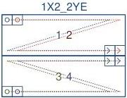

|  GEN<i>CAM |   |  emva  |
| --- | --- | --- |
|  Version 2.7.1 | Standard Features Naming Convention  |   |

2X2M-1Y (area-scan)

2 zones in X with 2 taps and middle extraction, 1 zone in Y.

Figure 29-25: Geometry 2X2M-1Y (area-scan)

2X2M (line-scan)

2 zones in X with 2 taps and middle extraction.

Figure 29-26: Geometry 2X2M (line-scan)

1X2-2YE (area-scan)

1 zone in X with 2 taps, 2 zones in Y with end extraction.

Figure 29-27: Geometry 1X2-2YE (area-scan)