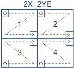
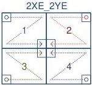
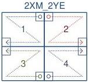

|  GEN<i>CAM |   | emva  |
| --- | --- | --- |
|  Version 2.7.1 | Standard Features Naming Convention  |   |

#### 2X-2YE (area-scan)

2 zones in X, 2 zones in Y with end extraction.

Figure 29-28: Geometry 2X-2YE (area-scan)

#### 2XE-2YE (area-scan)

2 zones in X with end extraction, 2 zones in Y with end extraction.

Figure 29-29: Geometry 2XE-2YE (area-scan)

#### 2XM-2YE (area-scan)

2 zones in X with middle extraction, 2 zones in Y with end extraction.

Figure 29-30: Geometry 2XM-2YE (area-scan)