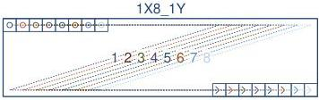
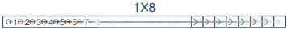
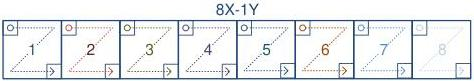

## 29.6 Octal Tap Geometries

1X8-1Y (area-scan)

1 zone in X with 8 taps, 1 zone in Y.

Figure 29-31: Geometry 1X8-1Y (area-scan)

1X8 (line-scan)

1 zone in X with 8 taps.

Figure 29-32: Geometry 1X8 (line-scan)

8X-1Y (area-scan)

8 zones in X, 1 zone in Y.

Figure 29-33: Geometry 8X-1Y (area-scan)

8X (line-scan)

8 zones in X.

Figure 29-34: Geometry 8X (line-scan)