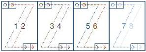
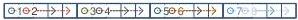
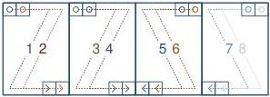

|  GEN<ì>CAM |   | emva  |
| --- | --- | --- |
|  Version 2.7.1 | Standard Features Naming Convention  |   |

4X2-1Y (area-scan)

4 zones in X with 2 taps, 1 zone in Y.

4X2_1Y

Figure 29-35: Geometry 4X2-1Y (area-scan)

4X2 (line-scan)

4 zones in X with 2 taps.

4X2

Figure 29-36: Geometry 4X2 (line-scan)

4X2E-1Y (area-scan)

4 zones in X with 2 taps and end extraction, 1 zone in Y.

4X2E_1Y

Figure 29-37: Geometry 4X2E-1Y (area-scan)

4X2E (line-scan)

4 zones in X with 2 taps and end extraction.

4X2E

Figure 29-38: Geometry 4X2E (line-scan)

2X2E-2YE (area-scan)

2 zones in X with 2 taps, 2 zones in Y with 2 taps.