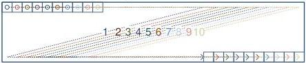
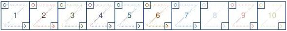

|  GENICAM |   | emva  |
| --- | --- | --- |
|  Version 2.7.1 | Standard Features Naming Convention  |   |

### 29.7 Deca Tap Geometries

1X10-1Y (area-scan)

1 zone in X with 10 taps, 1 zone in Y.

1X10_1Y

Figure 29-40: Geometry 1X10-1Y (area-scan)

1X10 (line-scan)

1 zone in X with 10 taps.

1X10

Figure 29-41: Geometry 1X10 (line-scan)

10X1Y (line-scan)

10 zone in X, 1 zone in Y with 10 taps.

10X-1Y

Figure 29-42: Geometry 10X-1Y (line-scan)